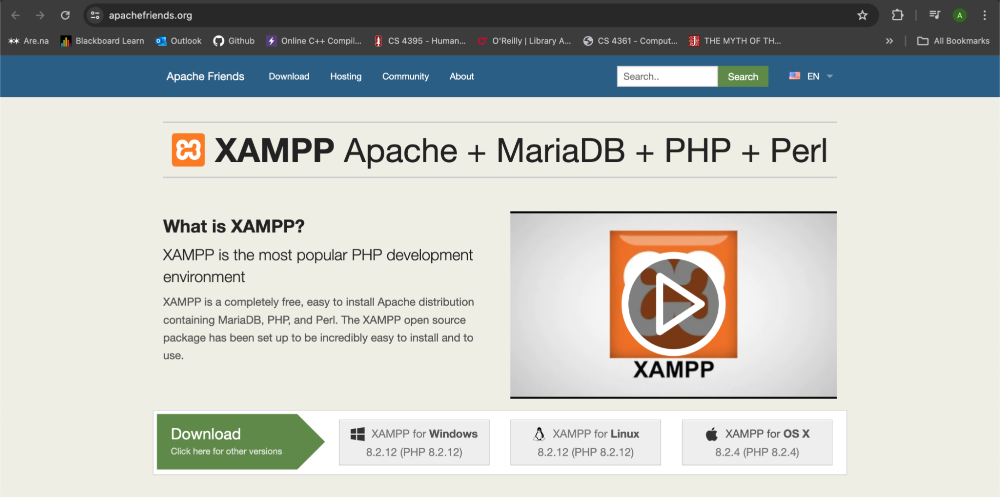
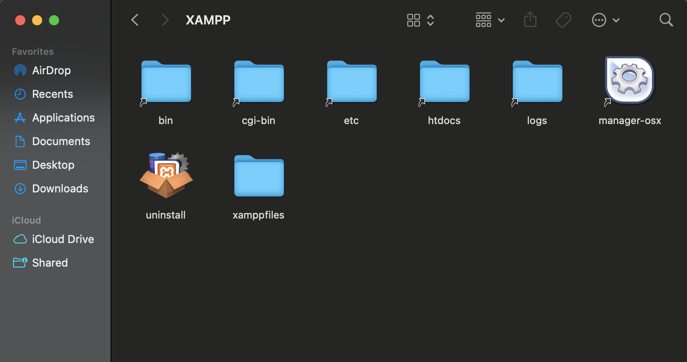
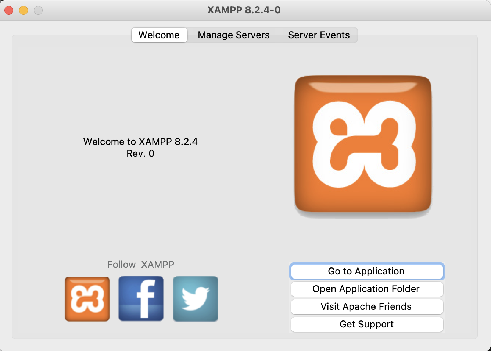

# EasyPark
An on-campus (UTD) parking solution. Go Comets!

# Getting Started 
## Prerequisites 

You will need to install and configure XAMPP on your machine to run this program. You can find and download the appropriate version of XAMPP from this link: https://www.apachefriends.org/

## Installation 

1. Once the installer is finished, launch the XAMPP Control Panel contained in the application folder 

3. Navigate to “Manage Server” and start all servers 

4. Place all source code from the unzipped file's /project folder in the application’s “htdocs” folder 

5. Navigate to the XAMPP homepage and launch phpMyAdmin: http://localhost/.
Specify the port associated with the Apache Web Server if necessary. This can be checked through the Control Panel in the server’s configurations.

6. Navigate to the “Databases” tab in phpMyAdmin and create a new database named “EasyPark”

7. With the database created/selected, navigate to the “Import” tab and select “Choose File”. Upload “schemaDef.sql” from the /project folder and select “Import”

8. Likewise, upload “testSchema.sql” from the /project folder and select “Import”. The database should now be constructed and populated with entries to demonstrate the CRUD operations. Additional dummy data files are contained in the /project folder for loading in phpMyAdmin

9. Navigate to the EasyPark homepage and select “Create User” or log in as an existing test user to explore available operations: http://localhost/homepage.html
